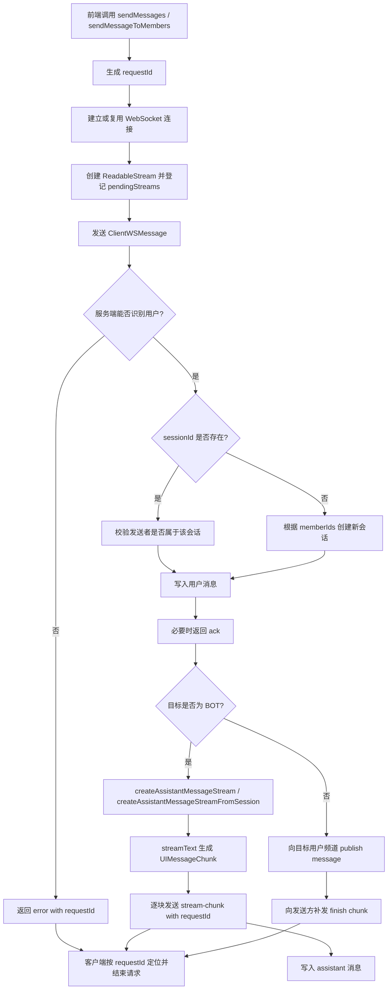
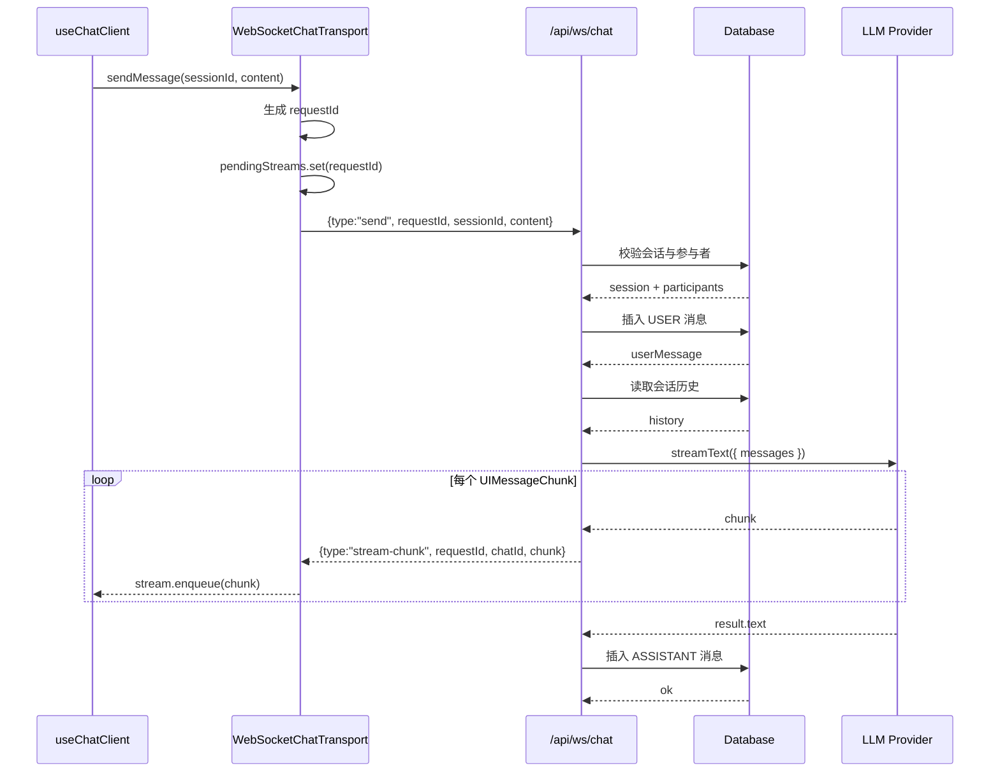
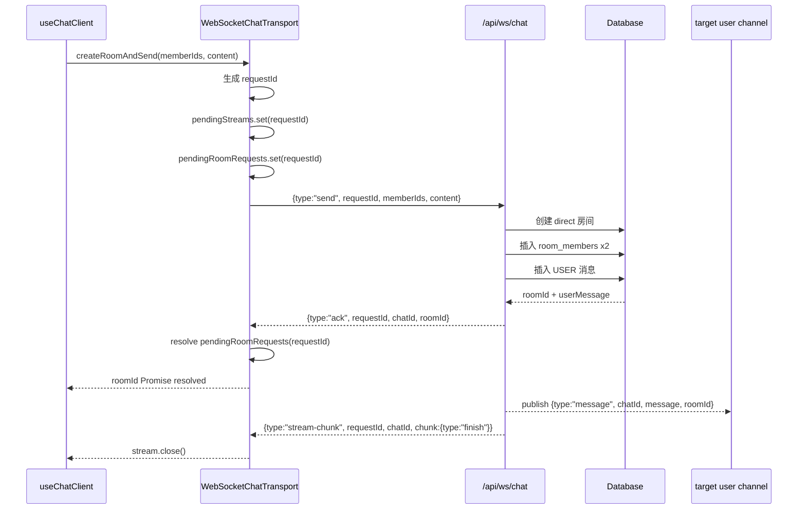
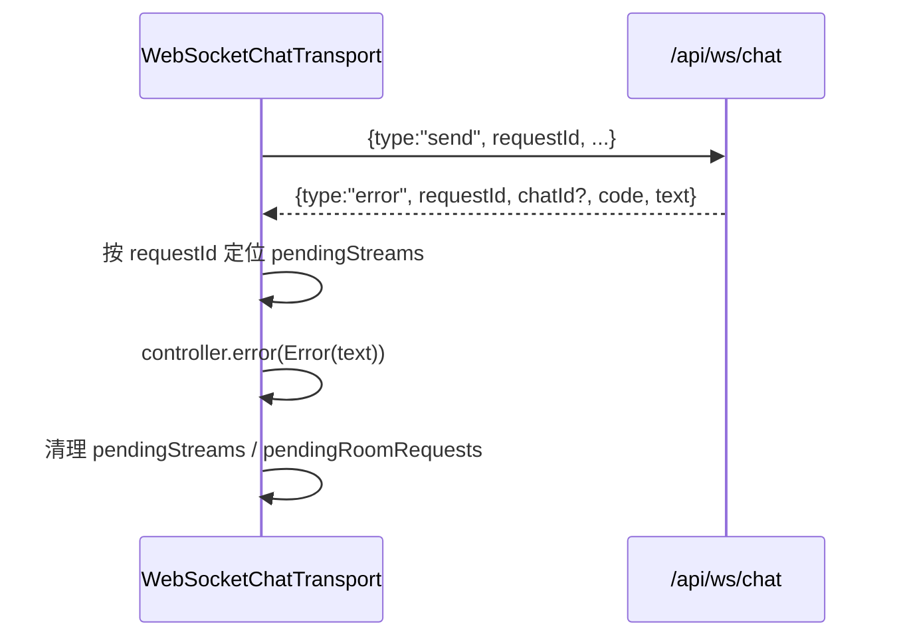

# WebSocket Chat 当前方案

本文档描述当前仓库中 WebSocket 聊天链路的实际设计，覆盖以下文件：

- `app/composables/WebSocketChatTransport.ts`
- `app/composables/useChatClient.ts`
- `server/api/ws/chat.ts`
- `server/services/chat-command.service.ts`
- `server/ecosystem/core/AssistantInstant.ts`

目标是把 AI SDK 5 的 `ChatTransport` 接口适配到 WebSocket 通道，并保证以下能力：

- 复用单条 WebSocket 连接
- 用 `requestId` 追踪单次发送请求
- 支持已有会话发送与新建会话发送
- 新建会话时统一使用 `memberIds`，不再沿用 `targetUserId`
- 对 Bot 会话返回 AI SDK 标准 `UIMessageChunk`
- 对普通用户会话主动补发 `finish`，避免流悬空
- 错误回包可精确关联到当前请求

## 协议定义

### 客户端 -> 服务端

```ts
type ClientWSMessage =
  | {
      type: "send";
      requestId: string;
      roomId?: string;
      memberIds?: string[];
      content: string;
      messageId?: string;
    }
  | {
      type: "typing";
      roomId: string;
    }
  | {
      type: "read";
      roomId: string;
      messageId: string;
    };
```

### 服务端 -> 客户端

```ts
type ServerWSMessage =
  | {
      type: "ack";
      requestId: string;
      chatId: string;
      roomId: string;
    }
  | {
      type: "message";
      requestId?: string;
      chatId: string;
      message: UIMessage;
      roomId?: string;
    }
  | {
      type: "stream-chunk";
      requestId?: string;
      chatId: string;
      chunk: UIMessageChunk;
    }
  | {
      type: "typing";
      chatId: string;
      userId: string;
    }
  | {
      type: "error";
      requestId?: string;
      chatId?: string;
      code: string;
      text: string;
    };
```

约束说明：

- `requestId` 只用于定位一次发送请求，不用于标识会话。
- `roomId` 只在“首次创建会话”时，由服务端回给发起方。
- `chatId` 表示当前会话 ID。
- `memberIds` 表示“除当前用户外”要参与新会话的成员列表；当前这条旧链只接受 1 个成员，因此仍只会创建 `direct`。
- `stream-chunk` 的 `chunk` 必须是 AI SDK 标准 `UIMessageChunk`。

## 核心状态

客户端 `WebSocketChatTransport` 维护三类状态：

- `ws`: 当前 WebSocket 连接实例
- `pendingStreams`: `requestId -> ReadableStream controller`
- `pendingRoomRequests`: `requestId -> roomId Promise resolver`

服务端 `chat.ts` 维护两类上下文：

- `peer.context.auth`: 当前连接用户身份
- `user:${userId}` 频道订阅：用于单播消息或输入态广播

## 统一消息生成入口

当前实现把“是否触发大模型消息”收敛到服务端统一入口：

- `chat-command.service.ts` 只负责准备会话、目标用户和用户消息
- `AssistantInstant.ts` 统一负责创建 assistant 消息流与最终落库

也就是说，HTTP 和 WS 虽然还是两个 adapter，但真正触发大模型的地方只剩一处：

- `createAssistantMessageStream(...)`

后续如果要加意愿打分、拦截器或观测逻辑，直接放在这里即可，不需要再去改 transport 层。

当前仓库中的真实行为是：

- `OWNER_INTERACTIVE -> BOT`：通过 `createAssistantMessageStream(...)` / `createAssistantMessageStreamFromSession(...)` 立即输出
- `OWNER_INTERACTIVE -> HUMAN`：直接单播转发
- 更完整的 `IntentionEngine pipelines` 仍保留在 `CYBER_ECOSYSTEM.md`，还没有完整落地到代码

## 总流程图



## 时序图

### 已有会话 -> BOT 会话



### 新建会话 -> direct 会话



### 错误回包



## 客户端处理规则

### 1. 发送规则

- `sendMessages` 只支持 `submit-message`
- 当前不支持 `regenerate-message`
- 最后一条消息从 `message.parts` 中提取纯文本，而不是访问不存在的 `message.content`
- “无 `roomId` 首发消息”当前改为使用 `memberIds`；为避免越过当前边界，这条旧链只接受 1 个成员并创建 `direct`

### 2. ACK 与广播分离

客户端收到服务端回包时分三类处理：

- `type: "ack"`：只用于解析新建会话返回的 `roomId`
- `type: "message"`：只作为频道广播，分发给聊天 UI
- `type: "stream-chunk"`：只推进当前请求的流式输出

这样可以避免当前用户发送后又把 ACK 当作外部广播重复渲染。

### 3. 流关闭规则

- `stream-chunk.type === "finish"`：关闭流
- `stream-chunk.type === "error"`：关闭流
- 服务端 `error` 消息：直接 `controller.error(...)`
- WebSocket 断开：所有挂起流统一失败

### 4. 手动关闭规则

`close()` 会设置 `intentionallyClosed = true`，因此：

- 用户主动断开不会触发自动重连
- 网络异常断开才会触发指数退避重连

## 服务端处理规则

### 1. 连接建立

- 从会话中识别用户
- 将鉴权信息写入 `peer.context.auth`
- 订阅 `user:${userId}` 频道

### 2. send 消息

已有会话：

- 验证会话存在
- 验证发送者是参与者
- 写入用户消息

新建会话：

- 根据 `memberIds` 找到目标用户
- 当前只接受 1 个成员，因此只创建 `direct`
- 写入双方参与者
- 写入用户消息

### 3. 目标分支

如果目标是 `BOT`：

- HTTP 路由使用 `createAssistantMessageStream(...)`
- WebSocket 路由使用 `createAssistantMessageStreamFromSession(...)`
- 两者最终都汇聚到同一个 assistant 消息生成入口
- 收尾时统一落库 assistant 消息

如果目标是普通用户：

- 通过 `peer.publish("user:...")` 单播消息
- 立即给发送方补发 `finish`

### 4. 错误处理

- 所有 `send` 相关错误都尽量带上 `requestId`
- 如果错误和会话强相关，则附带 `chatId`
- 客户端据此只结束当前请求，不影响其他并发流

## 当前方案解决的问题

- 解决了没有 `requestId` 时并发请求互相串流的问题
- 解决了新建会话时 `sessionId` Promise 无法稳定解析的问题
- 解决了普通用户会话没有 `finish` 导致前端流一直 pending 的问题
- 解决了把 ACK 错当成广播消息导致重复渲染的问题
- 解决了从 `UIMessage.content` 取值导致的发送内容读取错误
- 解决了手动关闭连接后仍继续自动重连的问题

## 当前边界

- `reconnectToStream()` 仍返回 `null`
- 当前 `app/components/chat/ChatBox.vue` 仍在使用 HTTP `DefaultChatTransport`
- 本文档描述的是 composable 与 WebSocket 路由层的当前方案，不等于聊天页已经切换到该方案
- 更细粒度的生态意愿管线还没有接到 `server/ecosystem/core/AssistantInstant.ts`
